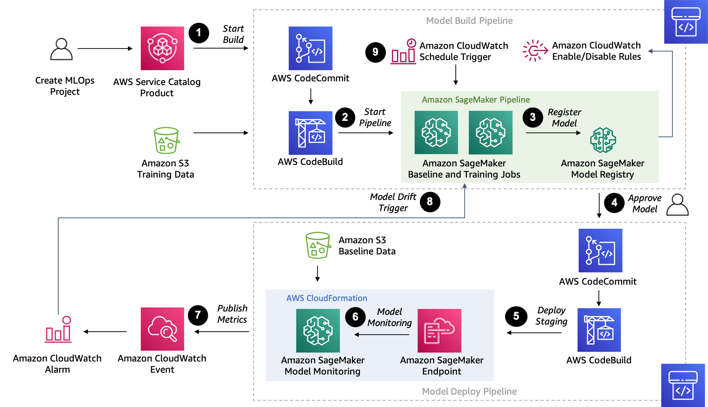
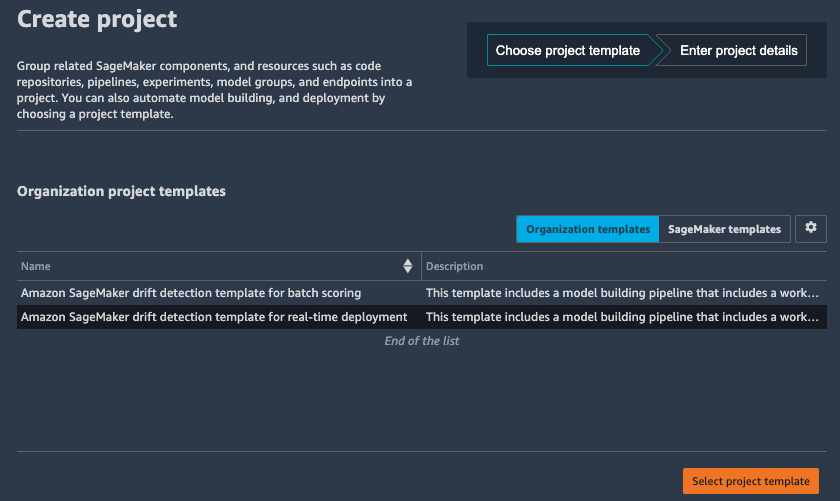
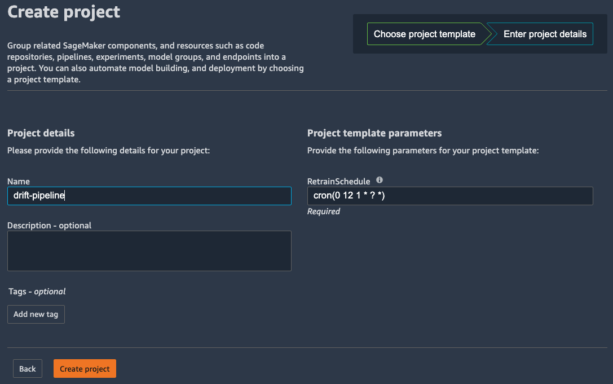
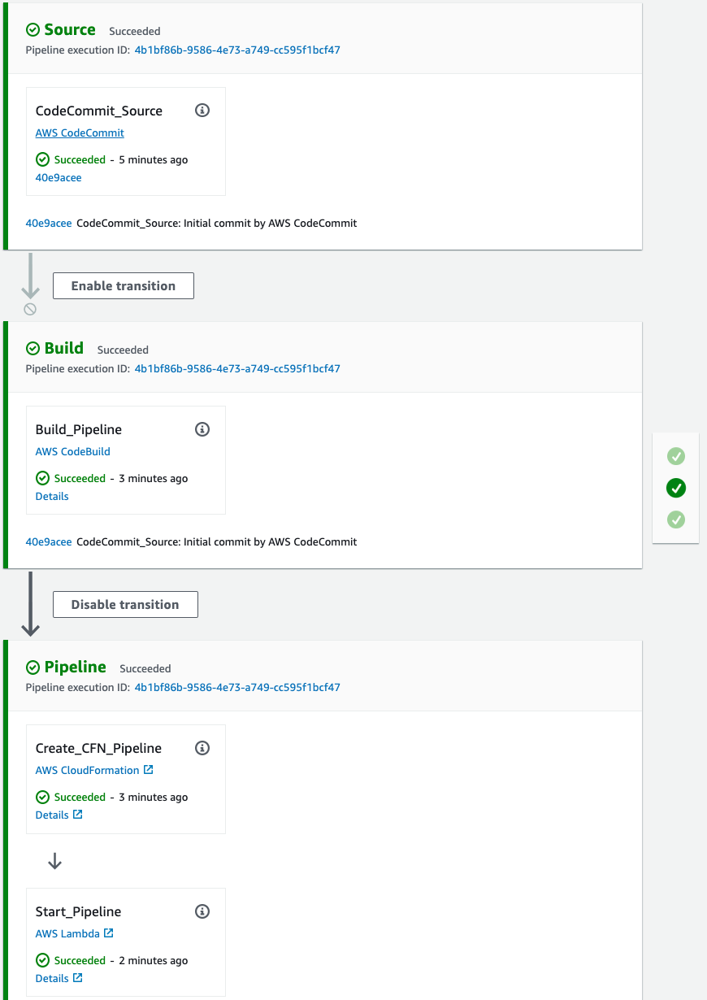
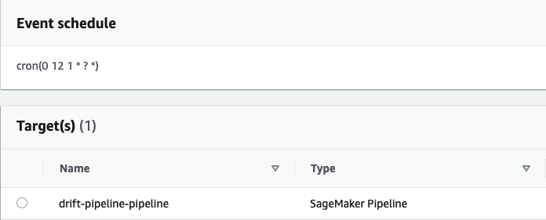
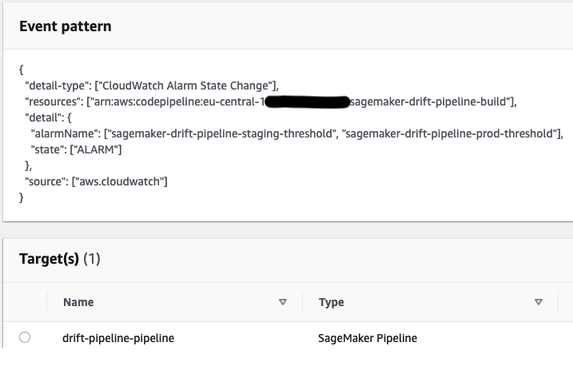
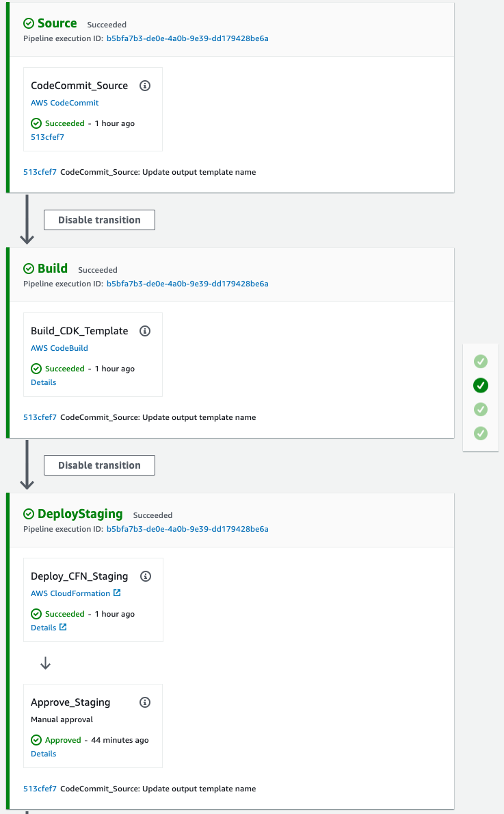

# Amazon SageMaker Drift Detection Pipeline

This sample demonstrates how to setup an Amazon SageMaker MLOps deployment pipeline for Drift detection



The following are the high-level steps to deploy this solution:

1. Publish the SageMaker [MLOps Project template](https://docs.aws.amazon.com/sagemaker/latest/dg/sagemaker-projects-templates.html) in the [AWS Service Catalog](https://aws.amazon.com/servicecatalog/)
2. Create a new Project in [Amazon SageMaker Studio](https://docs.aws.amazon.com/sagemaker/latest/dg/sagemaker-projects-create.html)

Once complete, you can Train and Deploy machine learning models, and send traffic to the Endpoint to cause the Model Monitor to raise a drift alert.

## Get Started

You the following quick start to publish the custom SageMaker MLOps template:

[](https://console.aws.amazon.com/cloudformation/home?region=us-east-1#/stacks/quickcreate?templateUrl=https%3A%2F%2Famazon-sagemaker-safe-deployment-pipeline.s3.amazonaws.com%2Fdrift-pipeline%2Fdrift-service-catalog.yml&stackName=drift-pipeline&param_ExecutionRoleArn=&param_PortfolioName=SageMaker%20Organization%20Templates&param_PortfolioOwner=administrator&param_ProductVersion=1.0)

Alternatively to deploy from source, clone this repository.

```
git clone https://github.com/aws-samples/amazon-sagemaker-drift-detection
cd amazon-sagemaker-drift-detection.git
```

## Prerequisites

This project uses the AWS Cloud Development Kit [CDK](https://aws.amazon.com/cdk/).  To [get started](https://docs.aws.amazon.com/cdk/latest/guide/getting_started.html) with AWS CDK you need [Node.js](https://nodejs.org/en/download/) 10.13.0 or later.

### Install the AWS CDK

Install the AWS CDK Toolkit globally using the following Node Package Manager command.

```
npm install -g aws-cdk
```

Run the following command to verify correct installation and print the version number of the AWS CDK.

```
cdk --version
```

### Setup Python Environment for CDK

This project uses AWS CDK with python bindings to deploy resources to your AWS account.

The `cdk.json` file tells the CDK Toolkit how to execute your app.

This project is set up like a standard Python project.  The initialization
process also creates a virtualenv within this project, stored under the `.venv`
directory.  To create the virtualenv it assumes that there is a `python3`
(or `python` for Windows) executable in your path with access to the `venv`
package. If for any reason the automatic creation of the virtualenv fails,
you can create the virtualenv manually.

To manually create a virtualenv on MacOS and Linux:

```
python3.8 -m venv .venv
```

After the init process completes and the virtualenv is created, you can use the following
step to activate your virtualenv.

```
source .venv/bin/activate
```

If you are a Windows platform, you would activate the virtualenv like this:

```
.venv\Scripts\activate.bat
```

Once the virtualenv is activated, you can install the required dependencies.

```
pip install -r requirements.txt
```

### Add Permissions for CDK

AWS CDK requires permissions to create AWS CloudFormation Stacks and the associated resources for your current execution role. If you have cloned this repository into SageMaker Studio, you will need to add an inline policy to your SageMaker Studio execution role. You can find your user's role ARN by browsing to the Studio dashboard.


The following commands will add the CDK-DeployPolicy to this  execution role. Before running them, substitute the role ARN. Alternatively you can follow the steps below using the AWS console.

Browse to the [IAM](https://console.aws.amazon.com/iam) section in the console, and find this role.

Then, click the **Add inline policy** link, switch to to the **JSON** tab, and paste the following inline policy:

```
{
    "Version": "2012-10-17",
    "Statement": [
        {
            "Action": [
                "s3:*"
            ],
            "Effect": "Allow",
            "Resource": [
                "arn:aws:s3:::cdktoolkit-*",
                "arn:aws:s3:::sagemaker-project-*"
            ]
        },
        {
            "Action": [
                "lambda:*"
            ],
            "Effect": "Allow",
            "Resource": [
              "arn:aws:lambda:*:*:function:drift-*"
            ]
        },
        {
            "Action": [
                "cloudformation:*",
                "servicecatalog:*",
                "events:*"
            ],
            "Effect": "Allow",
            "Resource": "*"
        },
        {
            "Effect": "Allow",
            "Action": [
                "iam:CreateRole",
                "iam:DeleteRole"
            ],
            "Resource": "arn:aws:iam::*:role/drift-*"
        },
        {
            "Effect": "Allow",
            "Action": [
                "iam:GetRole",
                "iam:PassRole",
                "iam:GetRolePolicy",
                "iam:AttachRolePolicy",
                "iam:PutRolePolicy",
                "iam:DetachRolePolicy",
                "iam:DeleteRolePolicy",
                "iam:CreateServiceLinkedRole"
            ],
            "Resource": [
              "arn:aws:iam::*:role/drift-*",
              "arn:aws:iam::*:role/service-role/AmazonSageMaker*"
            ]
        }
    ]
}
```

Click **Review policy** and provide the name `CDK-DeployPolicy` then click **Create policy**

### Bootstrap the CDK

If this is the first time you have run the CDK, you may need to [Bootstrap](https://docs.aws.amazon.com/cdk/latest/guide/bootstrapping.html) your account.  If you have multiple deployment targets see also [Specifying up your environment](https://docs.aws.amazon.com/cdk/latest/guide/cli.html#cli-environment) in the CDK documentation.

```
cdk bootstrap
```

You should now be able to list the stacks by running:

```
cdk list
```

Which will return the following stacks:

* `drift-service-catalog`
* `drift-pipeline`

## Publish the MLOps Template

In this section you will publish the MLOPs Project template to the AWS Service Catalog.

### Deploy the SageMaker MLOps Project template

Run the following command to deploy the MLOps project template, passing the required `ExecutionRoleArn` parameter.  You can copy this from your SageMaker Studio dashboard as show above.

```
export EXECUTION_ROLE_ARN=<<sagemaker-studio-execution-role>>
cdk deploy drift-service-catalog \
    --parameters ExecutionRoleArn=$EXECUTION_ROLE_ARN \
    --parameters PortfolioName="SageMaker Organization Templates" \
    --parameters PortfolioOwner="administrator" \
    --parameters ProductVersion=1.0
```

You will be presented with the list of changes, and asked to confirm to deploy these changes.

`NOTE`: If you are seeing errors running the above command ensure you have [Enabled SageMaker project templates for Studio users](https://docs.aws.amazon.com/sagemaker/latest/dg/sagemaker-projects-studio-updates.html) to grant access to these resources in Amazon S3.

## Creating a new Project in Amazon SageMaker Studio

Once your MLOps project template is registered in *AWS Service Catalog* you can create a project using your new template.

1. Switch back to the Launcher
2. Click **New Project** from the **ML tasks and components** section.

On the Create project page, SageMaker templates is chosen by default. This option lists the built-in templates. However, you want to use the template you published for the Amazon SageMaker Drift Detection Pipeline.

6. Choose **Organization templates**.
7. Choose **Amazon SageMaker Drift Detection Pipeline**.
8. Choose **Select project template**.



9. In the **Project details** section, for **Name**, enter **drift-pipeline**.
  - The project name must have 32 characters or fewer.
10. In the Project template parameters
  - For **RetrainSchedule**, input a validate [Cron Schedule](https://docs.aws.amazon.com/sagemaker/latest/dg/model-monitor-schedule-expression.html) which defaults to `cron(0 12 1 * ? *)` - the first day of every month.
11. Choose Create project.



`NOTE`: If you have recently updated your AWS Service Catalog Project, you may need to refresh SageMaker Studio to ensure it picks up the latest version of your template.

### Create project with CDK

Alternatively you can run the following command to create the drift pipeline for an existing project:

```
export SAGEMAKER_PROJECT_NAME=<<existing-project-name>>
export SAGEMAKER_PROJECT_ID=<<existing-project-id>>
cdk deploy drift-pipeline -c drift:ProductsUseRoleName="" \
    --parameters SageMakerProjectName=$SAGEMAKER_PROJECT_NAME \
    --parameters SageMakerProjectId=$SAGEMAKER_PROJECT_ID
```

## Model Build Pipeline

The model build pipeline contains three stages:
1. Source: This stage pulls the latest code from the **AWS CodeCommit** repository.
2. Build: The **AWS CodeBuild** action creates an Amazon SageMaker Pipeline definition and stores this definition as a JSON on S3. Take a look at the pipeline definition in the CodeCommit repository `build_pipeline/pipelines/pipeline.py`. The build also creates an **AWS CloudFormation** template using the AWS CDK - take a look at the respective CDK App `build_pipeline/app.py`.
3. Pipeline: This stage creates the **AWS CloudFormation** stack that has been synthesized in the  Build stage to create/update the Amazon SageMaker Pipeline. If successful, CodePipeline triggers an AWS Lambda function to start an execution of the SageMaker Pipeline to retrain our model. This Lambda function also disables the Build stage whilst the retraining pipeline is running.



The training data used in this example is set to a default bucket in the SageMaker Pipeline definition. You can copy additional records from the [NYC Taxi Dataset](https://registry.opendata.aws/nyc-tlc-trip-records-pds/) to the input folder like so:

```
aws s3 cp "s3://nyc-tlc/trip data/green_tripdata_2018-02.csv" s3://<<artifact-bucket>>/<<project-id>>/input/
```

### Triggering the model retraining

The full Model Build pipeline outlined above will start on the condition that code is committed to **AWS CodeCommit** repository. The model retraining workflow, the SageMaker Pipeline, has multiple triggers:
1. Code is committed to the **AWS CodeCommit** repository and the CloudFormation stack is successfully updated.
2. A scheduled AWS CloudWatch Events rule based on a [cron expression](https://docs.aws.amazon.com/eventbridge/latest/userguide/eb-create-rule-schedule.html#eb-cron-expressions).



3. A CloudWatch rule that is triggered by an Alarm when Model Monitor emits a [Baseline Drift](https://docs.aws.amazon.com/sagemaker/latest/dg/model-monitor-interpreting-cloudwatch.html) metric.



When the Model Build pipeline has completed successfully, an AWS CloudWatch event will be published like so:

```
{
    "version": "0",
    "id": "1c5b01d5-46d8-4f5c-7f52-922609d259e0",
    "detail-type": "CodePipeline Pipeline Execution State Change",
    "source": "aws.codepipeline",
    "account": "<<account>>",
    "time": "2021-05-28T07:33:21Z",
    "region": "<<region>>",
    "resources": [
        "arn:aws:codepipeline:<<region>>:<<region>:sagemaker-<<project_name>>-build"
    ],
    "detail": {
        "pipeline": "sagemaker-<<project_name>>-build",
        "execution-id": "09714422-afff-4465-a5f8-651f1d80bba0",
        "state": "SUCCEEDED",
        "version": 2
    }
}
```

The SageMaker Pipeline will publish AWS CloudWatch events when it starts with `currentPipelineExecutionStatus` value of `Executing`.  And when it completes with a value of `Succeeded` or `Failed` like so:

```
{
    "version": "0",
    "id": "a732df3b-cedf-ed58-e8ca-0113c9cce39b",
    "detail-type": "SageMaker Model Building Pipeline Execution Status Change",
    "source": "aws.sagemaker",
    "account": "<<account>>",
    "time": "2021-05-28T07:46:07Z",
    "region": "<<region>>",
    "resources": [
        "arn:aws:sagemaker:<<region>>:<<account>>:pipeline/<<project_name>>-pipeline",
        "arn:aws:sagemaker:<<region>>:<<account>>:pipeline/<<project_name>>-pipeline/execution/<<execution_id>>"
    ],
    "detail": {
        "pipelineExecutionDescription": "SageMaker Drift Detection Pipeline",
        "pipelineExecutionDisplayName": "<<project_name>>-pipeline",
        "currentPipelineExecutionStatus": "Succeeded",
        "previousPipelineExecutionStatus": "Executing",
        "executionStartTime": "2021-05-28T07:33:35Z",
        "executionEndTime": "2021-05-28T07:46:07Z",
        "pipelineArn": "arn:aws:sagemaker:<<region>>:<<account>>:pipeline/<<project_name>>-pipeline",
        "pipelineExecutionArn": "arn:aws:sagemaker:<<region>>:<<account>>:pipeline/<<project_name>>-pipeline/execution/<<execution_id>>"
    }
}
```

An AWS CloudWatch Rule is configured to disable transitions in the Model Build pipeline, and disable Schedule/Drift CloudWatch rules whilst the SageMaker Pipeline is executing.

## Deploy Pipeline

The deploy pipeline contains four stages:
1. Source: This stage pulls the latest code from the **AWS CodeCommit** repository.
2. Build: The **AWS CodeBuild** action runs the AWS CDK app that queries the **SageMaker Model Registry** for the latest approved model and the respective **SageMaker Pipeline** execution for the [Data Quality Baseline](https://docs.aws.amazon.com/sagemaker/latest/dg/model-monitor-create-baseline.html). Using the `staging-config.json` and `prod-config.json` the CDK app creates two **AWS CloudFormation** templates for the staging and production deployments respectively. Have a look at the CDK app `deployment_pipeline/app.py`.
3. DeployStaging Pipeline: This pipeline executes the staging CloudFormation template to create/update a **SageMaker Endpoint** based on the latest approved model. The pipeline includes a manual approval gate, which triggers the deployment of the model to production.
4. DeployProd Pipeline: This deployment creates or updates a **SageMaker Endpoint** with [Data Capture](https://docs.aws.amazon.com/sagemaker/latest/dg/model-monitor-data-capture.html) enabled, and also creates a [Model Monitoring Schedule](https://docs.aws.amazon.com/sagemaker/latest/dg/model-monitor-scheduling.html) and an optionally a **CloudWatch Alarm** for drift detection against the previously queried data quality baseline.



### Triggering the Deploy Pipeline

The deploy pipeline outlined above will be triggered when code is committed to the **AWS CodeCommit** repository or when a model is approved in the **SageMaker Model Registry**. See below the CloudWatch event and the EventBridge rule used for triggering the deploy pipeline for the latter.

```
{
    "version": "0",
    "id": "c800a495-b000-072c-7392-c683e89c96a8",
    "detail-type": "SageMaker Model Package State Change",
    "source": "aws.sagemaker",
    "account": "<<account>>",
    "time": "2021-06-03T04:45:23Z",
    "region": "<<region>>",
    "resources": [
        "arn:aws:sagemaker:<<region>>:<<account>>:model-package/<<project_name>>/26"
    ],
    "detail": {
        "ModelPackageName": "<<project_name>>/<<version>>",
        "ModelPackageGroupName": "<<project_name>>",
        "ModelPackageVersion": <<version>>,
        "ModelPackageArn": "arn:aws:sagemaker:<<region>>:<<account>>:model-package/<<project_name>>/<<version>>",
        "CreationTime": 1622695255225,
        "InferenceSpecification": {
            "Containers": [
                {
                    "Image": "<<training-image>>",
                    "ImageDigest": "sha256:04889b02181f14632e19ef6c2a7d74bfe699ff4c7f44669a78834bc90b77fe5a",
                    "ModelDataUrl": "s3://sagemaker-project-<<project_id>>-build-<<region>>/<<project_id>>/model/pipelines-xxxxx/output/model.tar.gz"
                }
            ],
        },
        "ModelPackageStatus": "Completed",
        "ModelApprovalStatus": "Approved"
    }
}
```


## Security

See [CONTRIBUTING](CONTRIBUTING.md#security-issue-notifications) for more information.

## License

This library is licensed under the MIT-0 License. See the [LICENSE](LICENSE) file.
